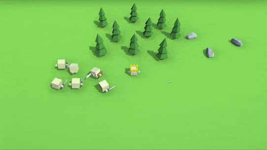

# King

As the king of this land you command your subjects by throwing them coins, or waving with your sword.
Be carefull with the sword, subjects don't like it. On the other hand, coins aren't infinite...

## Note
[Go to my C# scripts](Assets/Scripts)

## Implemented features
### Player

- walking / running
- throwing coin
- waving sword
- activating workplaces (trees to chop down, rocks to mine)

### NPC
</img>
- behavior trees AI
- wandering around
- running for coins
- working in workplaces when motivated

### World
</img>
- tileable, bitmasked, random generated terrain

### Other
- controller support

### Used tools
- [Node Canvas](https://assetstore.unity.com/packages/tools/visual-scripting/nodecanvas-14914) for AI behavior trees
- Bitmasked terrain
- Blender (every mesh and animation)
